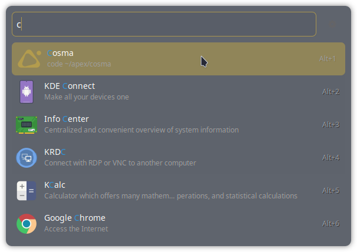

# COSMO theme for Ulauncher

The theme that matches COSMO color scheme, some incompatibilities may occur, sorry, you can change the css file optionally.



## Installation

Run the following script in your terminal:

```shell
mkdir -p ~/.config/ulauncher/user-themes

git clone https://github.com/sociale11/ul-cosmo ~/.config/ulauncher/user-themes/ul-cosmo
```
